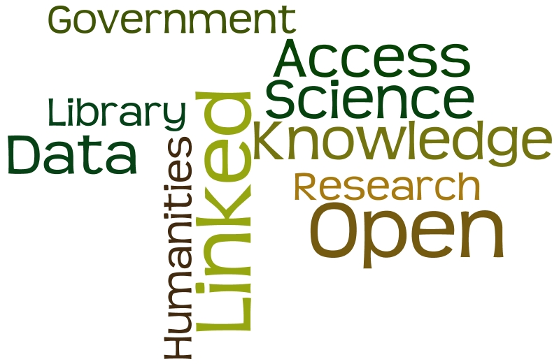

# The LODLAM(*) Mercury | Discover the Openness of Cultural and Scientific Heritage

(*) LODLAM = Linked Open Data in Libraries, Archives and Museums

**Das Weblog von Hans-Georg Becker** [ 0000-0003-0432-294X](https://orcid.org/0000-0003-0432-294X)

Dieses Blog wird von Hans-Georg Becker mit Inhalten gefüllt. Ich schreibe hier über meine Erfahrungen und Ergebnisse meiner Arbeit zur Darstellung von Informationen des kulturellen und wissenschaftlichen Erbes im Semantic Web. Dabei werden Themen wie Open Access, Open Science, Open Data, Linked Data, CIDOC CRM, FRBRoo, RDA, Forschungsdaten, Knowledge Organization u.v.a.m. behandelt.

Ich bin von Hause aus Mathematiker und habe 2008 den Studiengang M.L.I.S. des Instituts für Informationswissenschaft an der Fachhochschule Köln absolviert. Ich arbeite in der Universitätsbibliothek der Technischen Universität Dortmund.

Meine Publikationen werden durch die [Hochschulbibliographie der TU Dortmund]() in meinen ORCID Record übertragen.

Inhalt / Table of Contents

* [Volume 1, 2013](volume1.md)
* [Volume 2, 2014](volume2.md)

---
[Impressum](impressum.md)

The LODLAM Mercury von Hans-Georg Becker steht unter einer [Creative Commons Namensnennung 4.0 Unported Lizenz](https://creativecommons.org/licenses/by/4.0/deed.de).